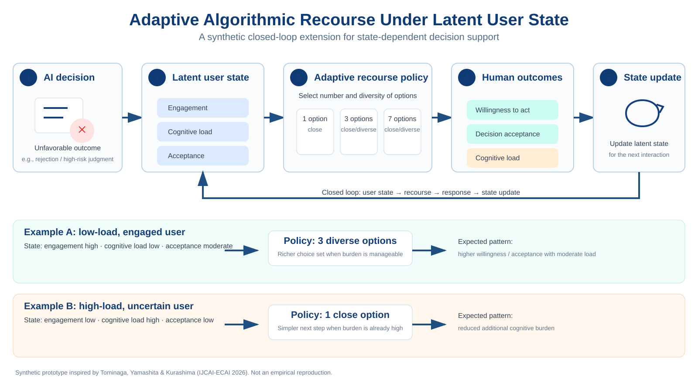

# Adaptive Algorithmic Recourse Under Latent User State
## A Synthetic Closed-Loop Prototype for Human-Centered Decision Support

**Author:** Akane Ito  
**Version:** 0.1.0  
**Date:** 2026-09-29  
**Repository:** `itoitoakaaka/human-behavior-modeling`

<p align="center">
  
</p>

## Abstract

Algorithmic recourse provides actionable changes that may help a person overturn an unfavorable AI decision. Recent work by Tominaga, Yamashita, and Kurashima (IJCAI-ECAI 2026) showed that diversifying recourse options can produce psychological benefits for small option sets, while large diverse sets can make cognitive load more salient. This technical note presents a synthetic, closed-loop extension of that idea. Instead of presenting the same recourse set to every user, the proposed prototype represents a latent user state consisting of engagement, cognitive load, and acceptance, and selects the number and diversity of recourse options as a function of that state. The user response is then used to update the latent state for the next interaction. The implementation is intentionally transparent and uses hand-specified coefficients rather than fitted human data. It should therefore be interpreted as a computational thought experiment and software prototype, not as an empirical reproduction or evidence of intervention effectiveness. The aim is to provide a minimal test bed for studying state-aware, human-centered recourse policies and to motivate future experiments in which latent user state is estimated from behavioral or physiological measurements.

**Keywords:** algorithmic recourse, human-centered AI, decision support, cognitive load, latent state, personalization, adaptive intervention

## 1. Motivation

Algorithmic recourse is intended to provide people with actionable ways to respond to unfavorable algorithmic decisions. A central design problem is that offering more alternatives can be useful while also increasing decision burden. Tominaga, Yamashita, and Kurashima studied this trade-off experimentally by manipulating recourse-set size and diversity in a between-subjects study with 750 participants. Their results indicate that diversification can improve psychological benefits, including willingness to act, for smaller sets without additional psychological cost, whereas cognitive load becomes more salient for large diverse sets.

That result suggests a natural next question:

> Should the size and diversity of recourse sets be fixed, or should they adapt to the current state of the person receiving the recommendation?

The present prototype explores the second possibility.

## 2. Relation to Prior Work

This project is **inspired by**, but does not reproduce, the IJCAI-ECAI 2026 study. The original authors provide public analysis code and supplementary material. Their participant-level dataset is not bundled with the repository and is described as potentially available under restricted conditions upon reasonable request.

The empirical findings that motivate this prototype are limited to the qualitative structure used here:

1. diversity can improve psychological benefits for smaller recourse sets;
2. large diverse recourse sets can make cognitive load more salient;
3. human cognition and psychology therefore matter when designing recourse diversification.

No coefficient in this implementation is estimated from the original participant data.

## 3. Proposed Closed-Loop Model

### 3.1 Latent user state

The user is represented by a bounded latent state

[
z_t = [e_t,; c_t,; a_t]^	op,
]

where:

- (e_t) is engagement,
- (c_t) is cognitive load,
- (a_t) is acceptance of the AI decision or decision-support process.

Each component is constrained to ([0,1]).

### 3.2 Candidate recourse policies

The prototype considers five candidate policies:

| Set size | Diversity |
| ---: | --- |
| 1 | close |
| 3 | close |
| 3 | diverse |
| 7 | close |
| 7 | diverse |

A single-option set has no meaningful diversity manipulation.

### 3.3 Synthetic response model

For each user state and candidate policy, the model predicts three quantities:

- willingness to act;
- decision acceptance;
- cognitive load.

The expected utility is

[
U_t =
0.60 W_t +
0.40 A_t -
lambda(c_t) L_t,
]

where (W_t) is willingness to act, (A_t) is decision acceptance, and (L_t) is predicted cognitive load.

The burden weight increases with the user's current cognitive load:

[
lambda(c_t) = lambda_0 + 0.90 c_t.
]

This state dependence is the core extension. A user who is already cognitively burdened is treated as more sensitive to the additional complexity of a large recourse set.

### 3.4 Policy selection

At each interaction,

[
pi(z_t) = argmax_{p in mathcal{P}} U(z_t,p).
]

In the current illustrative parameterization, an engaged low-load state tends to select **three diverse options**, while a high-load uncertain state tends to select **one close option**. These outputs are consequences of hand-specified synthetic coefficients and should not be read as validated human-behavior predictions.

### 3.5 State update

After an intervention, the state is updated using a simple retention rule:

[
z_{t+1}
=

ho z_t
+
(1-
ho) r_t,
]

where (r_t) contains the predicted response variables and (
ho=0.80) by default.

This produces a minimal closed loop:

[
	ext{user state}

ightarrow
	ext{recourse policy}

ightarrow
	ext{human response}

ightarrow
	ext{state update}.
]

## 4. Implementation

The implementation is available in:

```text
src/behavior_modeling/adaptive_recourse.py
examples/adaptive_recourse_demo.py
tests/test_adaptive_recourse.py
assets/adaptive_recourse_overview.svg
```

Run the demonstration with:

```bash
python examples/adaptive_recourse_demo.py
```

The code is intentionally small enough that every modeling assumption can be inspected directly.

## 5. What This Prototype Demonstrates

The prototype demonstrates three ideas.

First, algorithmic recourse can be represented as a sequential decision-support problem rather than a one-shot interface choice.

Second, user burden can enter the policy objective explicitly instead of being treated only as a post-hoc usability measure.

Third, latent state provides a bridge from human measurement to adaptive AI. In a future implementation, (z_t) need not be hand-initialized. It could be estimated from behavioral traces such as response latency, abandonment, repeated choice changes, or from multimodal measurements such as gaze, movement variability, physiological signals, or other indicators of workload and engagement.

## 6. Limitations

This project has several important limitations.

The response model is synthetic. Its coefficients were chosen to encode plausible qualitative behavior and the published trade-off between recourse benefits and cognitive cost; they were not fit to human data.

The latent state is directly available to the controller. A real system would have to infer it under uncertainty.

The utility function is normative and incomplete. It combines willingness, acceptance, and cognitive load, but does not yet model autonomy, fairness, feasibility, trust calibration, or long-term consequences.

The state update rule is illustrative and is not a validated cognitive model.

The prototype therefore should not be used to make real high-stakes decisions or to claim that a particular recourse policy is optimal for any population.

## 7. Next Research Steps

A natural empirical program would contain four stages.

1. **State estimation.** Estimate engagement, cognitive load, and acceptance from observable behavior and, where appropriate, physiological measurements.
2. **Model identification.** Fit the response model and state transition parameters using human-subject data.
3. **Policy comparison.** Compare fixed and adaptive recourse policies prospectively.
4. **Human-centered evaluation.** Evaluate not only task effectiveness, but also cognitive load, perceived usefulness, autonomy, trust, fairness, and willingness to act.

A stronger computational extension would model the problem as a partially observable sequential decision process in which latent user state must be inferred from noisy observations before an intervention is selected.

## 8. Reproducibility and Scope

All current examples use synthetic values and contain no participant data. The repository is designed so that the assumptions underlying the adaptive policy are explicit and testable.

The project should be cited as a **technical note / software artifact**, not as a peer-reviewed empirical study.

## 9. Reference

Tominaga, T., Yamashita, N., & Kurashima, T. (2026). *Psychological Benefits and Costs of Diversifying Algorithmic Recourse*. Proceedings of the Thirty-Fifth International Joint Conference on Artificial Intelligence, 7685–7693. https://doi.org/10.24963/ijcai.2026/854

## Suggested citation for this artifact

Ito, A. (2026). *Adaptive Algorithmic Recourse Under Latent User State: A Synthetic Closed-Loop Prototype for Human-Centered Decision Support* (Version 0.1.0) [Software and technical note].

> A DOI should be added here only after a Zenodo release has actually been archived.
